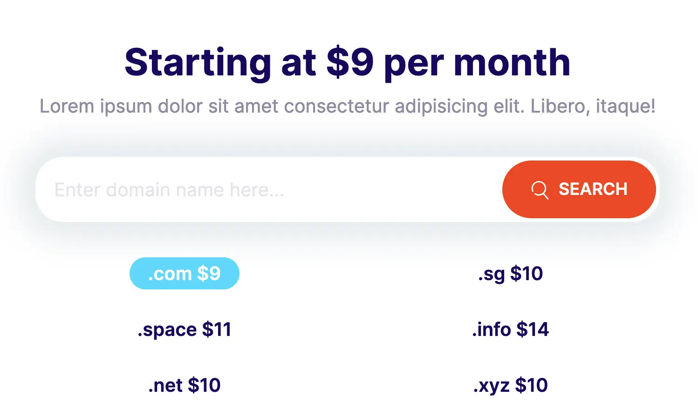
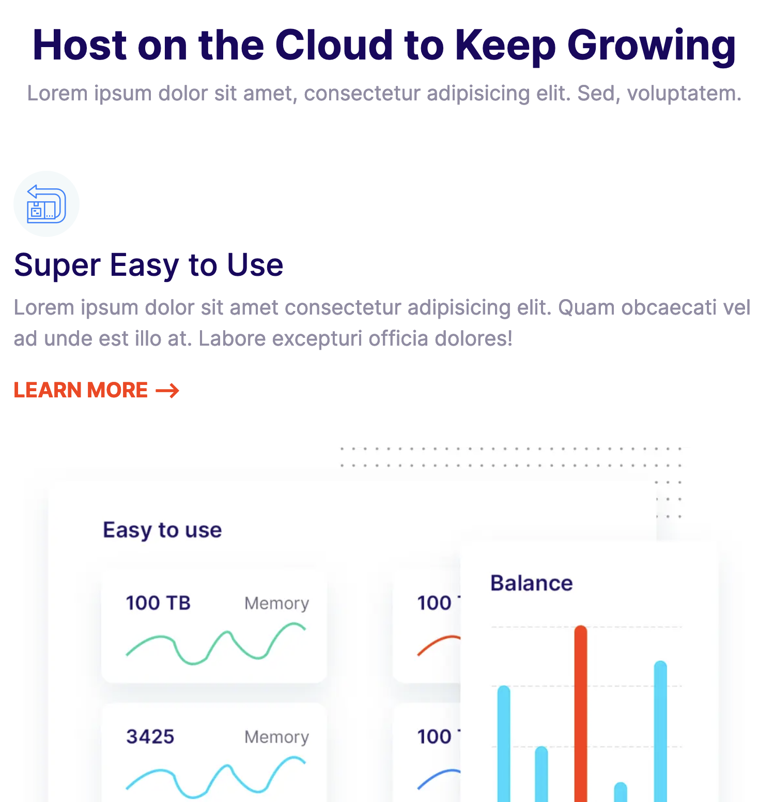
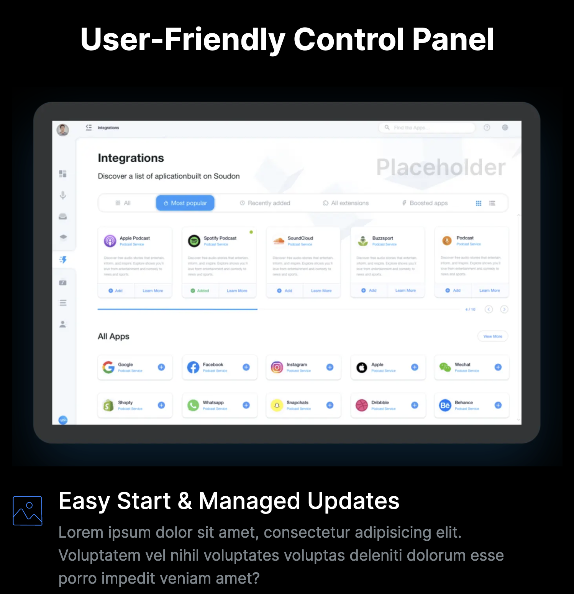
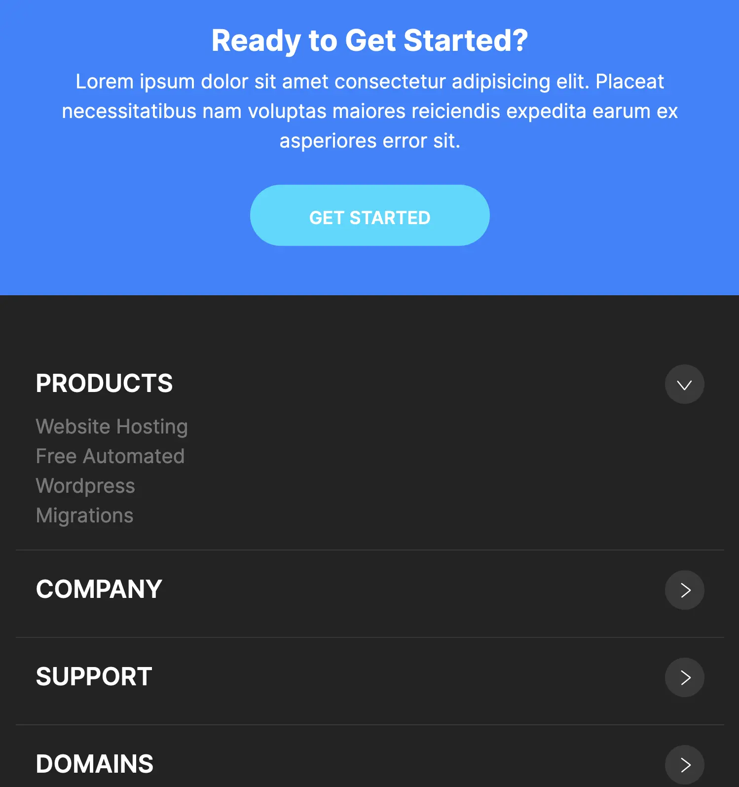
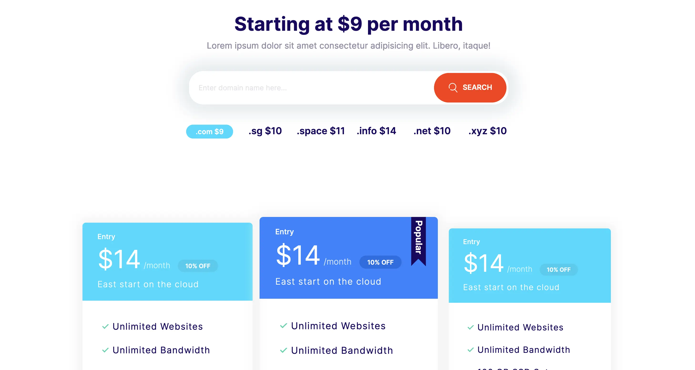
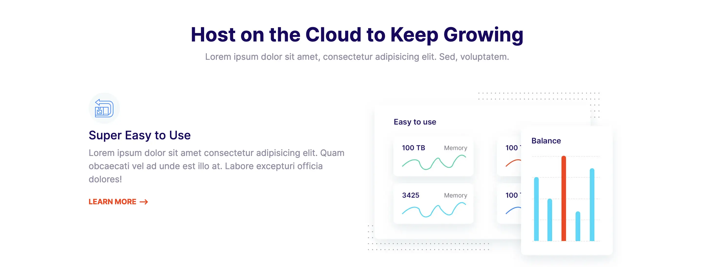
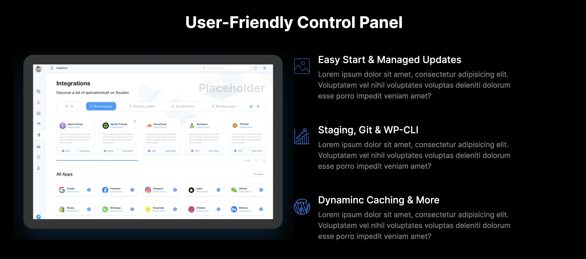
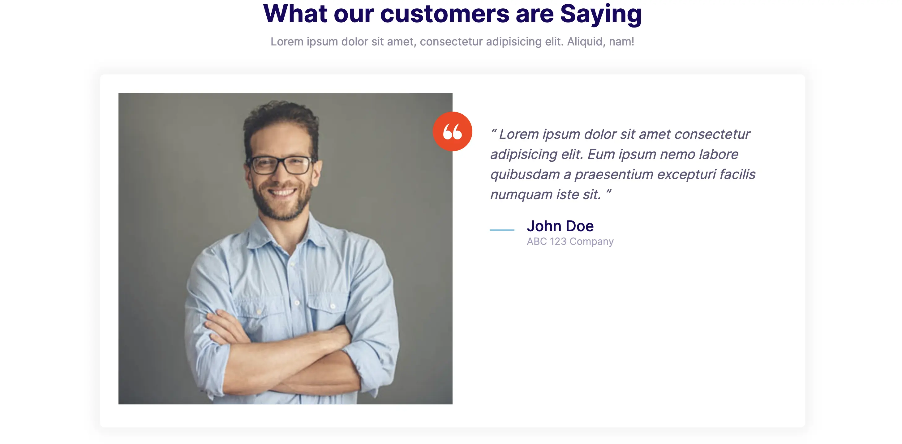
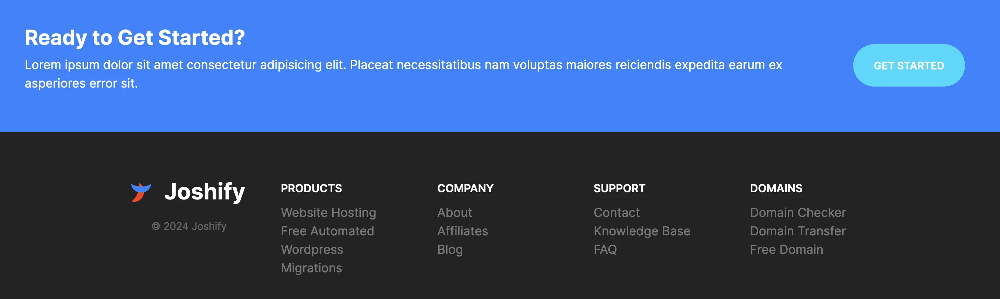

# ToC

-   [Joshify Website Page](#joshify-website-page)
    -   [Responsive Website Built For Mobile Up To Desktop](#responsive-website-built-for-mobile-up-to-desktop)
    -   [BEM Block-Element-Modifier](#bem-block-element-modifier)
    -   [Animations Script](#animations-script)
    -   [Website Examples](#website-examples)
        -   [Mobile Website Examples](#mobile-website-examples)
        -   [Desktop Website Examples](#desktop-website-examples)

# Joshify Website Page

## Component Based Website

This website/page was built with **component based design**. This gives the flexibility to change and add various features of the site elseware as needed.

## Responsive Website Built For Mobile Up To Desktop

This wesbsite/page was built initially **for mobile devices and made responsive for tablets, laptops, desktops, etc**.

## BEM Block-Element-Modifier

This website/page uses **BEM naming convention** for CSS.

A BEM class name includes up to three parts.

Block: The outermost parent element of the component is defined as the block.
Element: Inside of the component may be one or more children called elements.
Modifier: Either a block or element may have a variation signified by a modifier.

Ex: **[block]\_\_[element]--[modifier]**

## Animations Script

This uses animation scripts from the following site. This script spices up the website as the end user scrolls through.

https://michalsnik.github.io/aos/

## Website Examples

### Mobile Website Examples

### Desktop Website Examples

[Back To Top](#toc)
